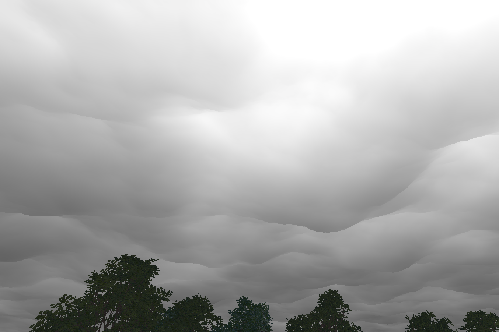
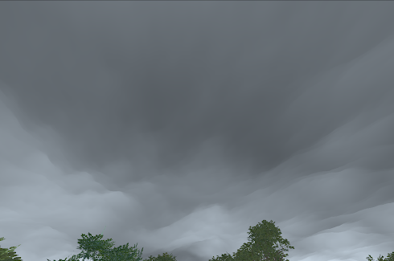
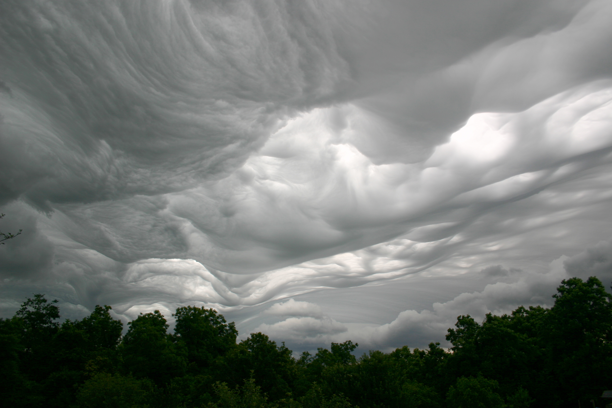

# Asperitas Cloud Simulation

This repository contains a real-time simulation of **Asperitas clouds**, combining **volumetric rendering** with **FFT-based wave simulation** to generate realistic, dynamic cloud formations.

This project merges two distinct techniques:

1. **Procedural volumetric rendering** – generates complex 3D cloud structures using noise functions.
2. **FFT-based wave simulation** – traditionally used for ocean surfaces, adapted here to simulate the rolling motion of clouds.

---

## 🔹 About the Project

Asperitas clouds are rare, dramatic cloud formations characterized by wave-like undulations. Traditional cloud simulation techniques often struggle to capture their dynamic complexity. By integrating procedural volumetrics and FFT wave simulations, this project creates a visually compelling and physically inspired representation of Asperitas clouds.

Key features include:

* Fully procedural volumetric clouds using noise textures.
* Dynamic undulations influenced by FFT-based wave simulation.
* Real-time rendering suitable for exploration and visualization.

---

## 🔹 How It Works

### Procedural Volumetric Rendering

Volumetric rendering represents clouds as 3D density fields rather than flat textures. In this project, **procedural noise** is used to generate density and detail at multiple scales, producing realistic turbulence and texture.

You can read more about the original volumetric rendering project here: [Volumetric Rendering Project Link](https://github.com/IretonLiu/cloud-simulation-unity)

### FFT-Based Wave Simulation

Fast Fourier Transform (FFT) techniques are typically used for simulating ocean surfaces by decomposing waves into frequency components. Here, we repurpose this method to create undulating cloud surfaces, giving the clouds a realistic rolling motion.

You can read more about the original wave simulation project here: [FFT Wave Simulation Project Link](https://github.com/IretonLiu/OceanSim-IFFT)

### Combining the Two

By using the FFT simulation to modulate the height and motion of the volumetric noise, we achieve the characteristic undulating appearance of Asperitas clouds while preserving the rich internal volumetric detail.

---

## 🔹 Screenshots

### Example Render 1

### Example Render 2

### Photo Reference

---

## 🔹 Future Improvements

* Integration of **lighting and shadows** for more realistic cloud illumination.
* Optimization for **real-time performance** on GPU.
* Adding **weather-driven parameters** for cloud formation dynamics.

